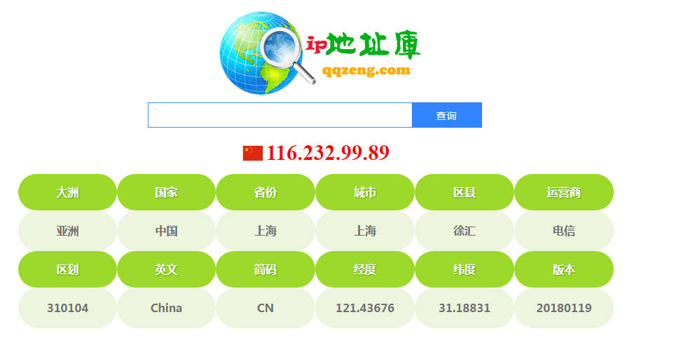

#qqzeng ip库
---

	高性能IP数据库格式详解 qqzeng-ip.dat
	
	编码：UTF8和GB2312  字节序：Little-Endian  
	
	返回多个字段信息（如：亚洲|中国|香港|九龙|油尖旺|新世界电讯|810200|Hong Kong|HK|114.17495|22.327115）
	
	------------------------ 文件结构 ---------------------------
	
	//文件头    16字节(4-4-4-4)
	[索引区第一条流位置][索引区最后一条流位置][前缀区第一条的流位置][前缀区最后一条的流位置] 
	
	//内容区    长度无限制
	[地区信息][地区信息]……唯一不重复
	
	//索引区    12字节(4-4-3-1)
	[起始IP][结束IP][地区流位置][流长度]
	
	//前缀区   9字节(1-4-4)
	[0-255][索引区start索引][索引区end索引]
	
	------------------------ 文件结构 ---------------------------
	
	优势：索引区分为[起始IP][结束IP][地区偏移][长度],减少多级偏移跳转步骤和长度的解析,提高效率;
	     根据ip第一位数字作为前缀,解析出以这个数字为前缀的第一个索引和最后一个索引,缩小查询区间,
	     然后在这区间再用二分查找快速查找到对应区间,效率提高几个等级    
	
	压缩：原版txt为35M,生成这种dat结构为3.36M 
	
	性能：解析500万+ip耗时1秒
	
	对比：相比其他dat更简洁更高效
	
	创建：qqzeng-ip 于 2015-08-08
	
	
		
	测试环境：CPU i7-7700K  + DDR2400 16G  + win10 X64
	
	查询 qqzeng-ip.dat 1836.1836万ip 3.213秒 每秒571.485714285714万次
	查询 qqzeng-ip.dat 694.06940万ip 1.215秒 每秒571.250534979424万次
	查询 qqzeng-ip.dat 1672.1672万ip 2.910秒 每秒574.627903780069万次
	查询 qqzeng-ip.dat 811.08110万ip 1.420秒 每秒571.183873239437万次
	查询 qqzeng-ip.dat 1570.1570万ip 2.728秒 每秒575.570747800586万次
	查询 qqzeng-ip.dat 1534.1534万ip 2.679秒 每秒572.658977230310万次
	查询 qqzeng-ip.dat 1758.1758万ip 3.073秒 每秒572.136609176739万次
	查询 qqzeng-ip.dat 556.05560万ip 0.976秒 每秒569.729098360656万次
	查询 qqzeng-ip.dat 665.06650万ip 1.161秒 每秒572.839362618432万次
	查询 qqzeng-ip.dat 1185.1185万ip 2.062秒 每秒574.742240543162万次
	查询 qqzeng-ip.dat 347.03470万ip 0.612秒 每秒567.050163398693万次
	查询 qqzeng-ip.dat 206.02060万ip 0.367秒 每秒561.364032697548万次
	查询 qqzeng-ip.dat 1044.1044万ip 1.824秒 每秒572.425657894737万次

#纯真ip库
---

### QQWry.Dat的格式如下:

	+----------+
	|  文件头  |  (8字节)
	+----------+
	|  记录区  | （不定长）
	+----------+
	|  索引区  | （大小由文件头决定）
	+----------+

文件头：4字节开始索引偏移值+4字节结尾索引偏移值

记录区： 每条IP记录格式 ==> IP地址[国家信息][地区信息]

### 对于国家记录，可以有三种表示方式：

       字符串形式(IP记录第5字节不等于0x01和0x02的情况)，
       重定向模式1(第5字节为0x01),则接下来3字节为国家信息存储地的偏移值
       重定向模式(第5字节为0x02),
   
   对于地区记录，可以有两种表示方式： 字符串形式和重定向

   最后一条规则：重定向模式1的国家记录后不能跟地区记录

索引区： 每条索引记录格式 ==> 4字节起始IP地址 + 3字节指向IP记录的偏移值

   索引区的IP和它指向的记录区一条记录中的IP构成一个IP范围。查询信息是这个
   范围内IP的信息

### 纯真数据库文件格式详解PDF：

	链接：https://pan.baidu.com/s/1bq3Rywv 密码：t1e4

### 更新dat文件

纯真IP最新数据库下载： [http://update.cz88.net/soft/setup.zip](http://update.cz88.net/soft/setup.zip) (首页: http://www.cz88.net/ )

	2.1 安装后在安装目录可以找到 qqwry.dat

	2.2 安装后可以定期更新数据库，更新后还是去安装目录找 qqwry.dat

可以爬取[https://www.iplocation.net/](https://www.iplocation.net/) 来更新ip。

官方论坛：[http://www.cz88.net/fox/](http://www.cz88.net/fox/)

格式说明:[http://demon.tw/copy-paste/qqwry-dat-format.html](http://demon.tw/copy-paste/qqwry-dat-format.html)

c语言：[http://blog.51cto.com/yifangyou/617658](http://blog.51cto.com/yifangyou/617658)